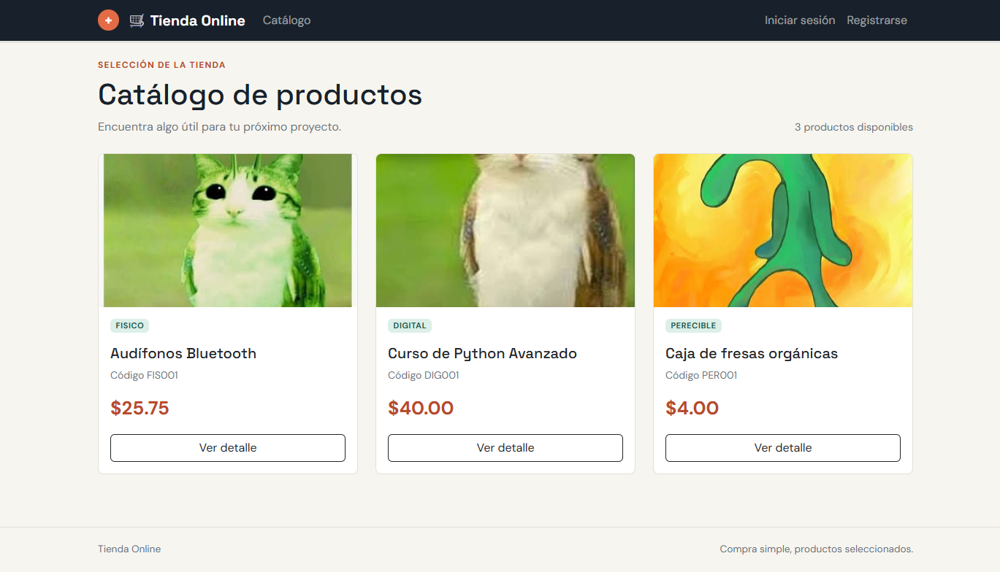
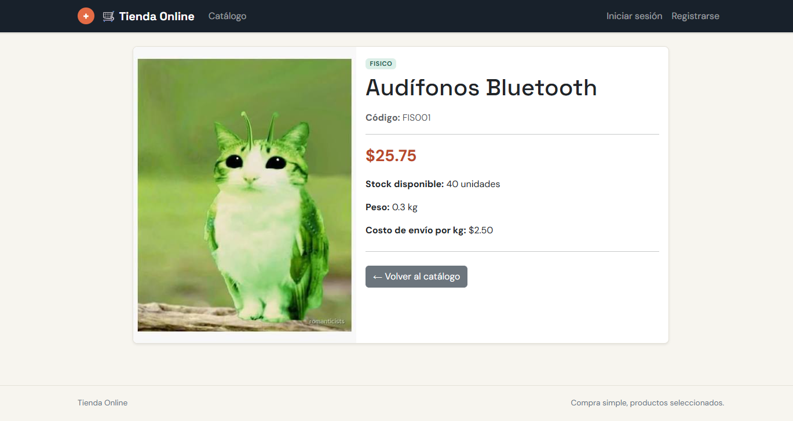
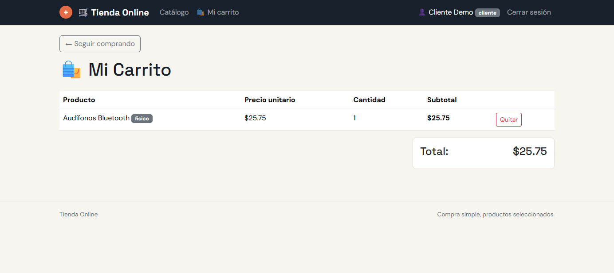

# Tienda Online

Aplicacion web de comercio electronico desarrollada con Flask y PostgreSQL. Permite consultar un catalogo de productos fisicos, digitales y perecibles, ver el detalle de cada producto y administrar un carrito de compras. Los usuarios administradores pueden crear, editar y desactivar productos.

## Requisitos

- Python 3.10 o superior
- PostgreSQL 13 o superior
- `pip`

## Instalacion

1. Clona el repositorio y entra en la carpeta del proyecto:

	```bash
	git clone <URL_DEL_REPOSITORIO>
	cd tienda_online
	```

2. Crea y activa un entorno virtual:

	En Windows PowerShell:

	```powershell
	python -m venv .venv
	.\.venv\Scripts\Activate.ps1
	```

	En macOS o Linux:

	```bash
	python3 -m venv .venv
	source .venv/bin/activate
	```

3. Instala las dependencias del proyecto. El archivo `requiriments.txt` contiene paquetes de analisis de datos, pero la aplicacion tambien necesita sus dependencias web y de base de datos:

	```bash
	pip install Flask Flask-SQLAlchemy psycopg2-binary python-dotenv
	pip install -r requiriments.txt
	```

4. Crea una base de datos PostgreSQL llamada `tienda_online`:

	```sql
	CREATE DATABASE tienda_online;
	```

	Si tus datos de PostgreSQL no coinciden con los valores predeterminados, define estas variables de entorno antes de continuar:

	```text
	DB_USER=postgres
	DB_PASSWORD=tu_contraseña
	DB_HOST=localhost
	DB_PORT=5432
	DB_NAME=tienda_online
	SECRET_KEY=una_clave_secreta
	```

5. Inicializa las tablas y los datos de prueba:

	```bash
	python init_db.py
	```

	Este comando reinicia las tablas existentes y crea los usuarios y productos de demostracion.

## Ejecucion

Con el entorno virtual activo y PostgreSQL en ejecucion:

```bash
python app.py
```

Abre [http://127.0.0.1:5000](http://127.0.0.1:5000) en el navegador.

## Credenciales de prueba

| Rol | Correo | Contraseña |
| --- | --- | --- |
| Administrador | `admin@tienda.com` | `admin123` |
| Cliente | `cliente@tienda.com` | `cliente123` |

Usa el usuario administrador para crear, editar o desactivar productos. Usa el usuario cliente para iniciar sesion, agregar productos y consultar el carrito.

## Capturas de pantalla

### Catalogo



### Detalle de producto



### Carrito de compras



Para reproducir estas vistas: inicia la aplicacion, abre el catalogo, entra en cualquier producto y, con la sesion del cliente iniciada, agrega un producto al carrito.